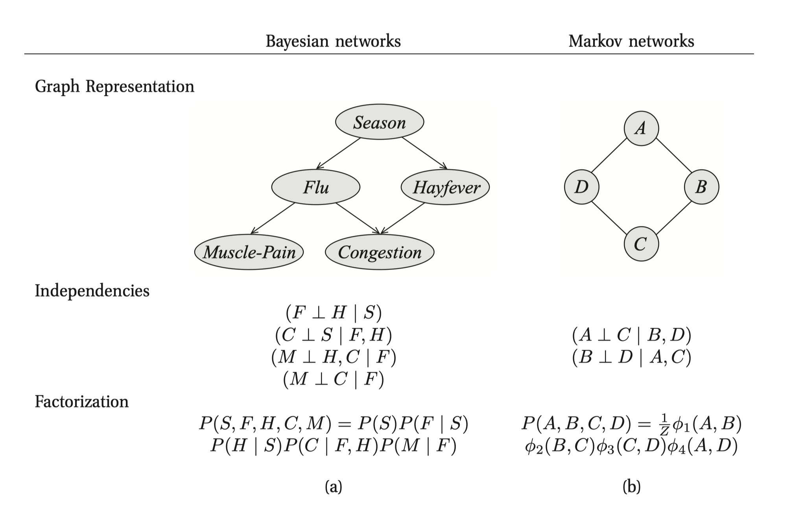
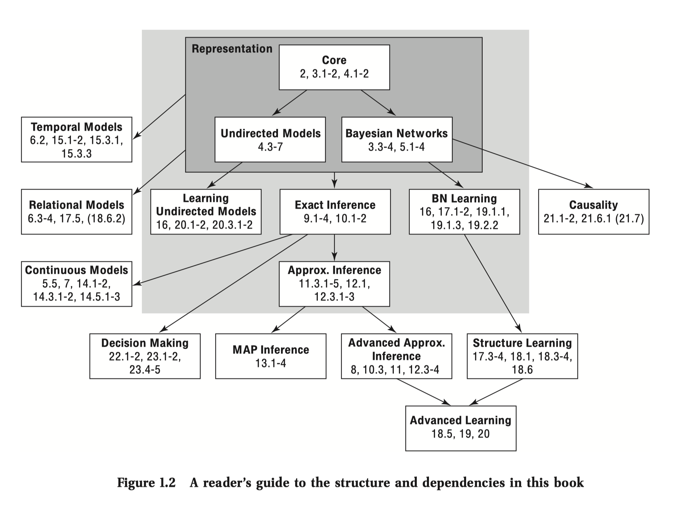

## Introduction

This is very first note, mainly content from chapter 1 of book. This chapter
about introduce what this book about and suggested roadmap of reading this book.

### 1. Motivation

There a type of question can be solved using reason (take available information
and reach conclusions). This book describe a framework that can be used to allow
computer system to solve such problem.

The most approach in this book are based on the concept called declarative
representation. In this approach, we construct, within the computer, a model of
the system about which we would like to reason. This model encodes our knowledge
of how the system works in a computer readable form. This representation can be
manipulated by various algorithms that can answer questions based on the model.

The key property of declarative representation is the separation of knowledge
and reasoning. Which means we can developed a suite of algorithms that can be
applied to any model in different domain, like medical and speech recognition.

### 2. Structured Probabilistic Models

This book described general purpose framework for constructing and using
probabilistic models of complex system.

Complex systems are characterized by the presence of multiple interrelated
aspects, many of which related to the reasoning task. These characters can be
described in terms of a sets of ***random variable***, where the value of each
variable defines an important property of the world.

Our task is to reason probabilistically about the value of one or more random
variables. In order to do so, we need to construct **joint distribution** over
space of possible assignment of a set of random variables.

#### 2.1 Probabilistic Graphical Models

Probabilistic graphical models use a graph-based representation as the basis of
compactly encoding a complex distribution over high-dimensional space. In
graphical representation, the nodes corresponding to variable in our domain. And
the edges represent direct probabilistic interaction between them. 

There are two perspective that one can used to interpret the structure of this
graph.

- This graph is the compact representation of a set of independencies that hold
  in the distribution. For example, like the graph above, we can know that Flu
  and Hayfever are independent given Season. Therefore, 
  $$P(Hayfever, Flu | Season) = P(Hayfever|Season) P(Flu|Season)$$
  
- Graph defines a skeleton for compactly representation a high-dimensional
  distribution. It can break a complex joint distribution into simpler one. Like
  factorization in the graph.
  
Actually, these two perspectives are equivalent in deep sense. 

There are two types of graph:

- Bayesian Network: using directed edges, like top left figure
- Markov Network: using undirected edges, like top right figure
  
  
  
#### 2.2 Representation, Inference and Learning 

- This framework allow the distribution to be written down tractably. Even the
  original distribution is large
- The same structure often allows the distribution to be used effectively for
  inference - answering query using distribution as our model of world
- This framework speed up the construction of these models. The process of
  construction is called learning 
  
These three component- representation, inference and learning - are critical
components in constructing a intelligent system.

### 3. RoadMap  

Here are structure of knowledge of this book. We will start with **core** then
go through the **representation**. 

Inference is our first pathway, after that we will go deep in Bayesian Network.
Then is Markov Network.
