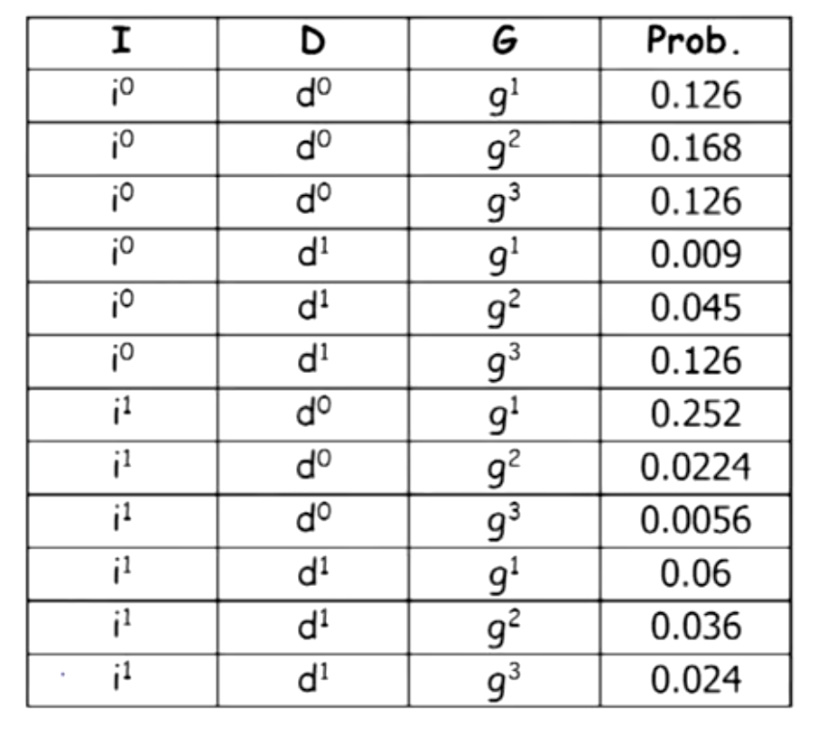
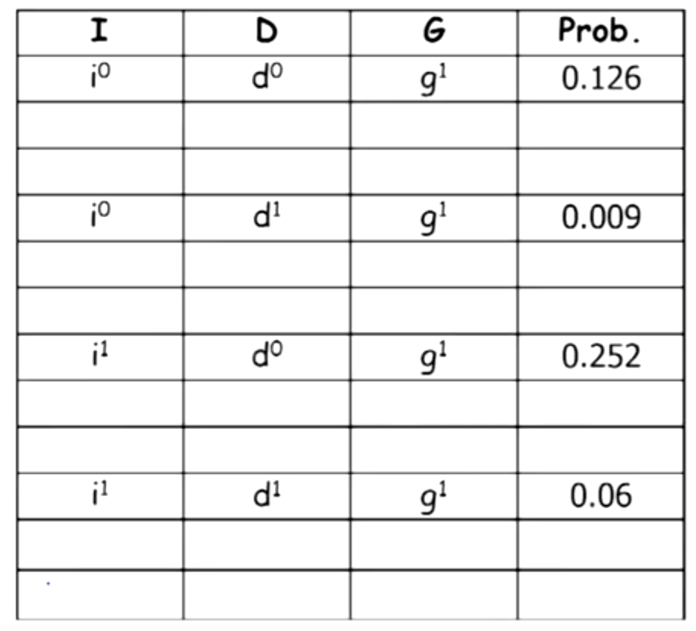
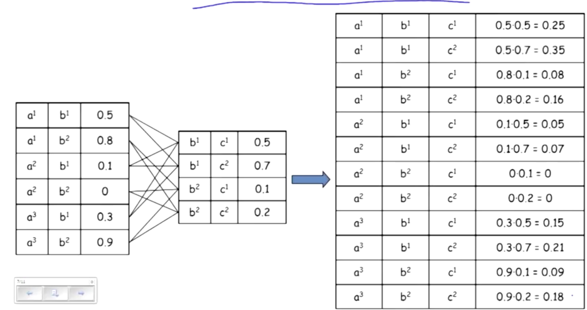
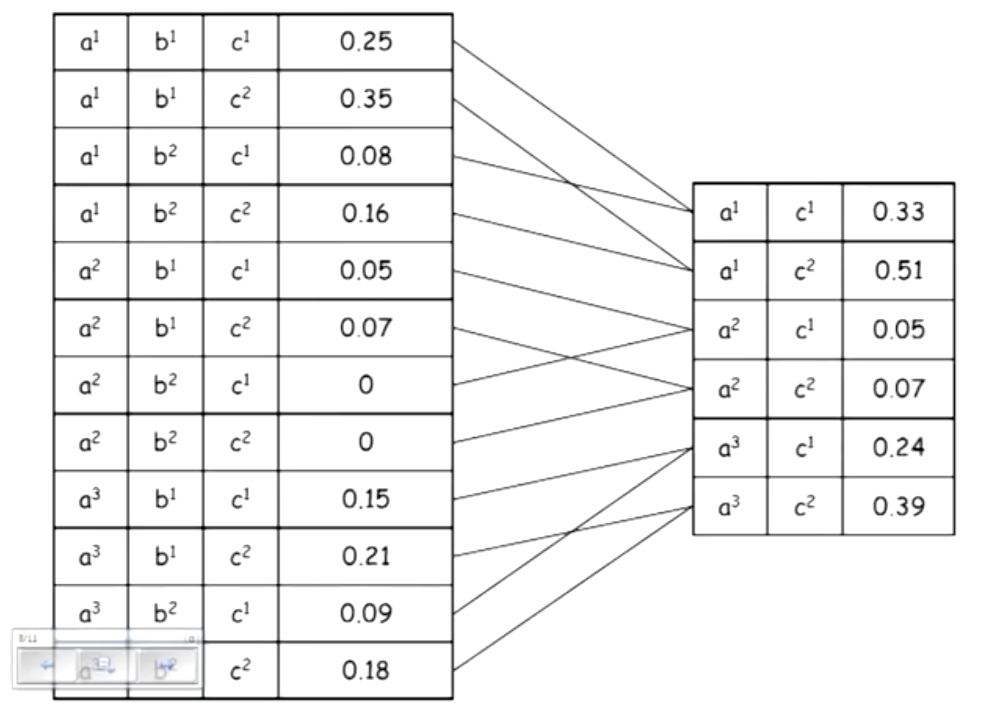

# Introduction and Preliminaries

## Distributions 

### Joint Distribution

Assume we have three random varibles. 
- Intelligence(I), we have two possible values $i^0$ and $i^1$
- Difficulty(D), we have two possible values $d^0$ and $d^1$
- Grade(G), we have three possible values $g^0$, $g^1$ and $g^2$

Here is a chart of possible distribution of these 3 random variables. This is an
example of $P(I,D,G)$.

There are 2*2*3 = 12 entries in this distribution. There are total 12 parameters
to reprensent this distribution.

**Independent parameters** are parameters whose value is not completely
determined by the value of other parameters. So in this case, since the sum of
prob. is 1. So we can know the independent parameters is 11.

### Conditioning

Assume we got the information $g^1$. Then the chart becomes:

We remove the distribution that not agree with our observation. This process
called **Redcution**. 

We can see that the remaining distribution do not satisfy
with the defination of distribution since the sum of all prob. is not 1. Then we
need a action called **Normalized measure**. We calculate the sum of all prob.
is 0.447, and we make every entry in the chart divied by 0.447.

### Marginalization

This operation take a subset of a distribution over large number of random
variables. Like following example. We have original distribution over $I$ and
$D$. Now we only want the distribution over $D$, that means we need marginalize
$I$.

The computation process over this example is $P(D) = \sum_I P(I,D)$

## Factors

Basically, factor can be seen as a function or a table. It takes arguments, like 
random variables, and take all possible assignments over scope and return a real
value. 

$\phi(X_1 .. X_k) \rightarrow R$, $Scope = \{X_1,..., X_k\}$

- As we already known joint distribution. We can see a joint distribution as a
factor.

- Besides that, we can see an unnormalized measure $P(I, D ,g^1)$ as a factor,
whose scope is $\{I,D\}$

- Conditional Probability Distribution(CPD), $P(G|I,D)$ can also be seen as a factor. 

**General Factors**, In theses factors the real value it return may not
represent the probability.

#### Factor Product

In this example, we have $\phi_1$, whose scope is $A, B$, and $\phi_2$, whose
scope is $B, C$. We product these two factor together we can get a factor
$\phi_3$, whose scope is $A, B, C$.

If we want to get a value in $\phi_3$, for example we want $\phi_3(a^1, b^1,
c^1)$, we
can calculate by $\phi_1(a^1, b^1) * \phi_2(b^1, c^1)$

#### Factor Marginalization

Factor marginalization is similar to the marginalization in the distribution. In
the following example, if we want to get $\phi(a^1, b^1)$, we need to sum over
all possible assignments over $b$

#### Factor Reduction

It's pretty same as reduction in distribution. For example we want to see the
context $c^1$, we only focus on the entries that satisfy the $c^1$.

#### Why Factor

- Fundamental building block for defining distributions in high-dimensional
  spaces.
- Set of basic operations for manipulating these probability distributions

